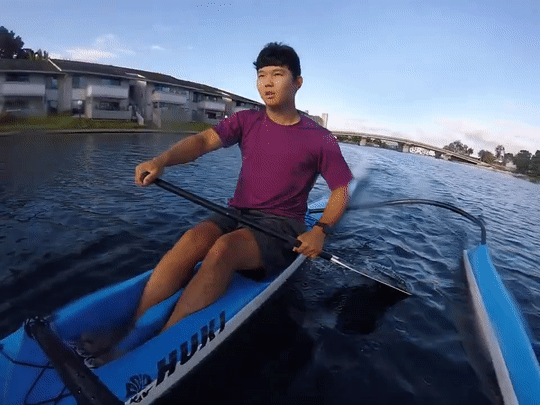
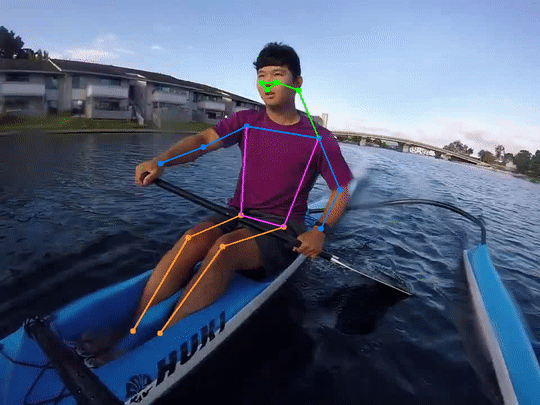
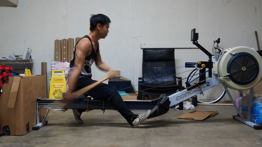
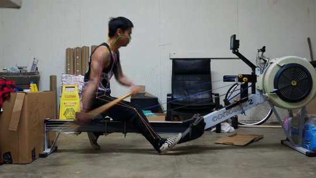

# DB PoseEstimation

Personal project to utilize pose estimation in order to analyze paddling form for dragon boats.

2D Pose Estimation based on YOLOv7:

|       Base Footage        |      Annotated Footage       |
| :-----------------------: | :--------------------------: |
|  |  |
|  |  |
